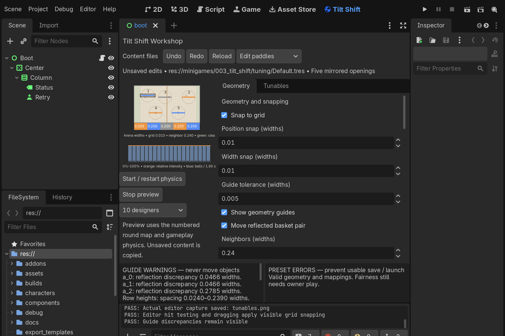
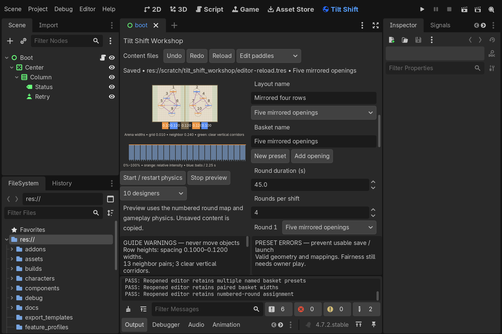
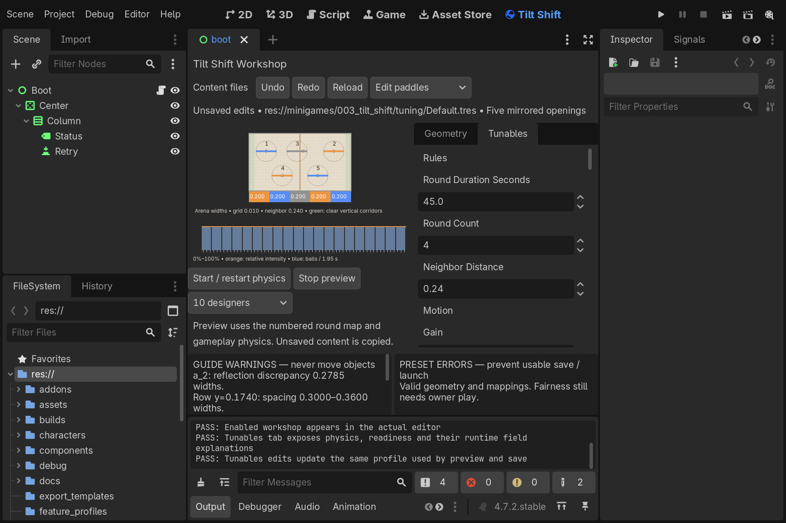
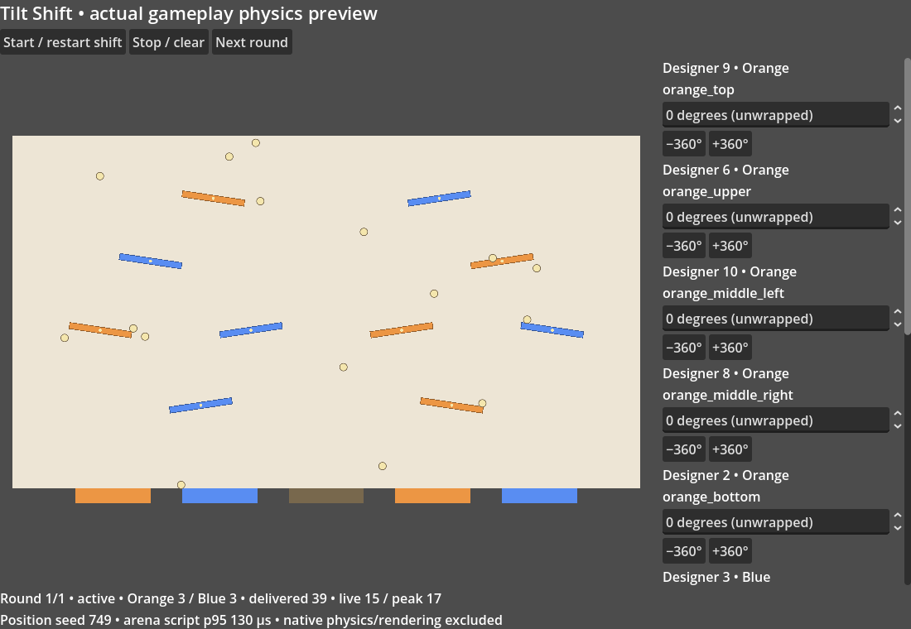

# Tilt Shift editor workshop

The **Tilt Shift** tab in Godot edits named layouts, baskets and profiles, and launches
the actual gameplay physics in a separate preview window. The workshop opens the active
Tilt Shift profile from `Tuning/Active Presets.tres`; edits stay in an independent draft.

## Edit geometry

1. Choose **Edit paddles**, select a numbered paddle and drag its anchor. The selected
   object's full stable ID, team and coordinates appear in the controls. Choose the editing
   layout separately from each round's mapping. A and B keep their own anchors and sizes;
   grey markers are automatic neutral paddles.
2. **Snap to grid** displays the grid and snaps both axes in arena-width units. The
   provisional position and width steps are `0.01` widths, or 10 physics units.
   Disable snapping for free placement; change the steps for finer work.
3. **Show geometry guides** draws reflection marks, full-turn swept circles, neighbor
   links and conservative clear vertical fall corridors. Selecting a paddle displays
   its neighboring distances. The report lists signed wall clearance and swept overlaps.
4. Guide tolerance starts at `0.005` widths, or 5 physics units. Uneven row/column
   spacing and reflection discrepancies are warnings, never automatic repositioning.
   Neighbor distance is the runtime proximity threshold, including vertical/diagonal pairs.

The canvas uses a paper-colored board and Orange/Blue/grey markers. Number labels identify
the array entries; selecting an entry exposes its stable identity. Swept circles are
conservative complete-turn bounds, rather than the current paddle pose.

## Edit baskets and round assignments

Choose **Edit baskets** and select an opening. With **Move reflected basket pair** enabled,
dragging moves its identified counterpart to the reflected center. Center trash stays
centered. Reordering preserves the pair's stable IDs; an overlap remains an explicit error.

**Paired width** snaps the width and changes both reflected scoring openings. A missing
or ambiguous team counterpart must be repaired first. Disable paired movement for a
single-opening draft repair. Trash away from the center needs reflected matching trash.

Use **New preset**, **Add opening** and the selected opening's category/removal controls
to construct other arrangements. Named presets appear in the basket selector. Loading
a basket adds it to that selector; choose it separately for each numbered round.

Changing **Rounds per shift** exposes missing or stale mappings. Choose **Missing** to
clear a round reference; remove surplus mappings explicitly with **Remove stale**.
Changing the editing basket or layout does not change a round assignment by itself.

The existing `baskets/FiveOpenings.tres` is the mirrored Orange, Blue, Trash, Orange,
Blue example. Basket count remains configurable. Invalid geometry, missing references,
unequal/missing reflected pairs, asymmetric trash, overlap and bounds errors block a
usable save or launch. Guide warnings remain separate from these errors.

## Save, load and apply

- **Content files → Load profile/layout/basket/physics** opens a named `.tres` file.
  Loading a profile replaces the entire draft; loading a layout or physics profile
  adds the layout to the draft library or replaces physics. Unsaved replacements require
  a discard decision.
- **Save usable…** writes validated named content below this minigame's `tuning/` folder.
  Save baskets/layouts separately to reuse them in another draft. Saving a profile
  captures all selected content and numbered-round references in a self-contained file.
- **Save draft…** permits invalid content below ignored `scratch/tilt_shift_workshop/`.
  Draft files can be reopened for repair. They are not usable round presets or exports.
- **Undo**, **Redo** and **Reload** operate on draft edits. A paired move/width change
  is one undo operation. The path and unsaved indicator show the current profile state.
- After saving a usable profile, **Apply saved profile to Active Presets** explicitly
  selects it for future runtime launches. Saving a named copy alone does not promote it.

Closing and reopening the editor does not save unsaved content automatically. Reload
the named files with **Content files**. A saved profile preserves repeated references:
rounds sharing one basket or layout still share it after reload. Unassigned drafts must
be saved separately; a profile stores the content selected by its numbered rounds.

Profiles saved by the workshop embed copies of selected content. Editing a separately
saved layout/basket later does not rewrite that profile. Load the revised component,
assign it and save the profile again. This keeps previews and runtime launches reviewable.

## Tunables and real physics preview

The **Tunables** tab exposes rules, motion, preparation timings, physics/delivery and
presentation settings from the runtime Resources. Field tooltips explain effects, units
and defaults; input ranges come from the same Resource metadata as the Inspector.
Round layout/basket maps and independent player/neutral sizes are editable there too.
**Geometry** retains snapped anchors, baskets and clearance diagnostics.

The controls expose separate positive and negative ball counts, optional position seed, offscreen spawn height,
delivery cutoff, ball geometry, gravity, entry speed, rotation speed, friction and bounce.
Use the progress/
intensity point controls to edit the linear delivery curve; add or remove points explicitly.

Negative delivery has separate point controls in Geometry and Tunables, with smooth
interpolation between points. Each graph shows relative intensity, scheduled ticks and
counts using the runtime scheduler. The positive graph spans the shortened delivery window;
the negative graph spans the full round. Counts and curves participate in undo/redo and saves.

**Negative ball color** selects the opaque fill tint with a color picker in Tunables.
The white outline is independent. The color is saved with physics content and participates
in undo/redo; preview or runtime restart applies the selected profile.

The budget remains independent of curve shape. Zero-intensity spans stay empty; a
positive budget with an all-zero curve is invalid. A seed repeats entry positions,
not physics, input, scoring or strategic outcomes. See [the physics guide](PHYSICS.md).

**Start / restart physics** copies the current profile and launches another Godot process.
Preview runs the numbered round map, rather than an unassigned basket being edited.
Select 2/4/6/8/10 designers to inspect ownership. Angle controls address synthetic players;
every selected paddle moves through the same host controller as gameplay. Designer
READY/CANCEL, recalibration and force-start controls exercise actual preparation phases.
Spectators keep idle stations and do not control paddles. Neutral rotation stays stopped
until the active clock begins.

The preview uses native ball contacts, rotating paddle bodies, delivery curves, basket
catches and exclusive deadlines. Angles are unwrapped: type repeated turns or use the
±360° buttons. **Next round** uses the next mapped preset after the deadline.
**Stop / clear** resets temporary bodies, assignments and scores; restarting starts a new shift.

The factory view uses the runtime presentation scene, including imported art fitted to
actual colliders, one player-colored lever operator per designer, cumulative scores,
round timer and cutoff/win/draw feedback. Its compact window is a preview; inspect the
full-size render captures before judging couch-distance readability.

**Stop preview**, closing the window or disabling the plugin closes the preview process
and removes its owned temporary snapshot. Changes made during preview require restart.
Preview never saves content or starts phone networking. Native physics/rendering are
excluded from the preview's displayed arena-script timing.

## Source, exports and evidence

Editor code lives in `addons/tilt_shift_workshop/`. Runtime Resources and the gameplay
arena remain in the minigame. Exports exclude the workshop, scratch content and these
documentation images while retaining usable runtime content.

`node tools/verify_tilt_shift_workshop.mjs` runs scripted interactions in two normal
editor launches, verifies save/reopen and preview cleanup, and writes captures below
`test-results/tilt-shift/workshop/`. It temporarily enables its test plugin and restores
`project.godot` afterward. Run it with other project editors closed.

The images here are real editor/runtime captures with synthetic input. They establish
composition and implementation behavior. Owner usability, snap/tolerance preferences,
fairness and game feel remain in [pending reviews](../../../docs/pending-reviews.md).
